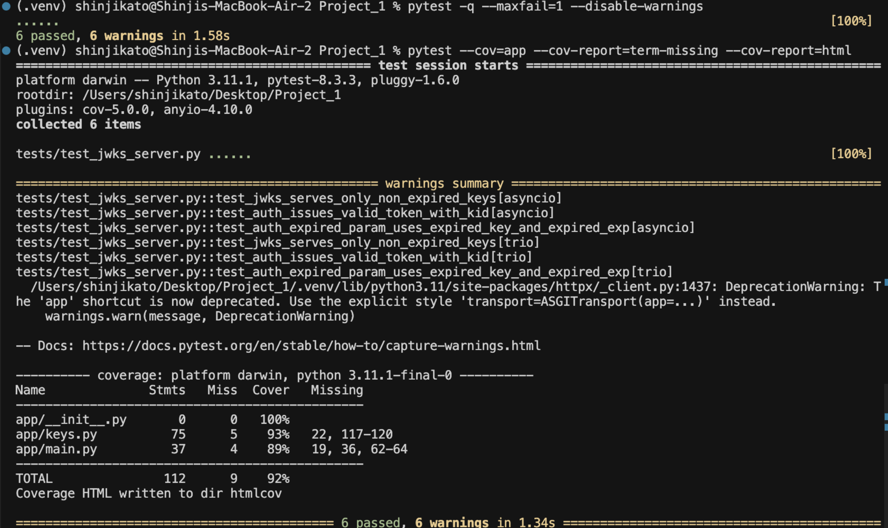
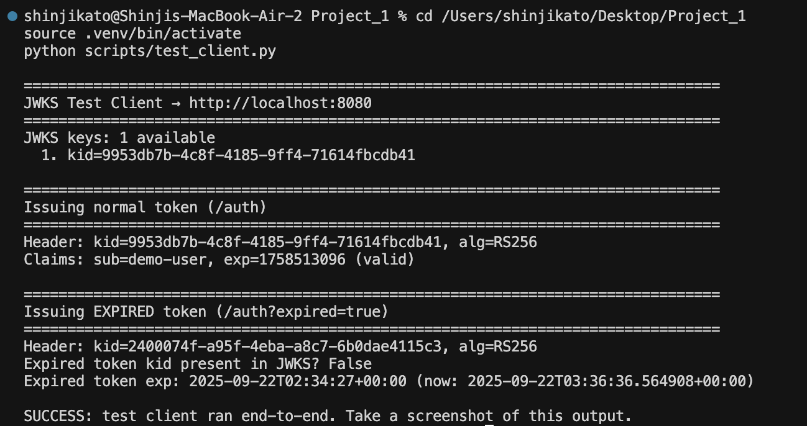

# JWKS Server (FastAPI + Python)

A simple educational JWKS server that:

- Serves a JWKS at `/jwks` containing only non-expired RSA public keys  
- Issues JWTs at `/auth`  
- Issues expired JWTs at `/auth?expired=true` (signed with an expired key, not in JWKS)

---

## Setup

```bash
python -m venv .venv
source .venv/bin/activate   # Windows: .venv\Scripts\activate
pip install -r requirements.txt
```

---

## Run

```bash
uvicorn app.main:app --reload --port 8080
```

- JWKS: `GET http://localhost:8080/jwks`  
- Token: `POST http://localhost:8080/auth`  
- Expired token: `POST http://localhost:8080/auth?expired=true`  

---

## Tests

```bash
pytest --cov=app --cov-report=term-missing
```



---

## Client

Run the included client:

```bash
python client.py
```



---

## Deliverables

- GitHub repo link  
- Screenshot of test results (`pytest`)  
- Screenshot of client run (`client.py`)  
